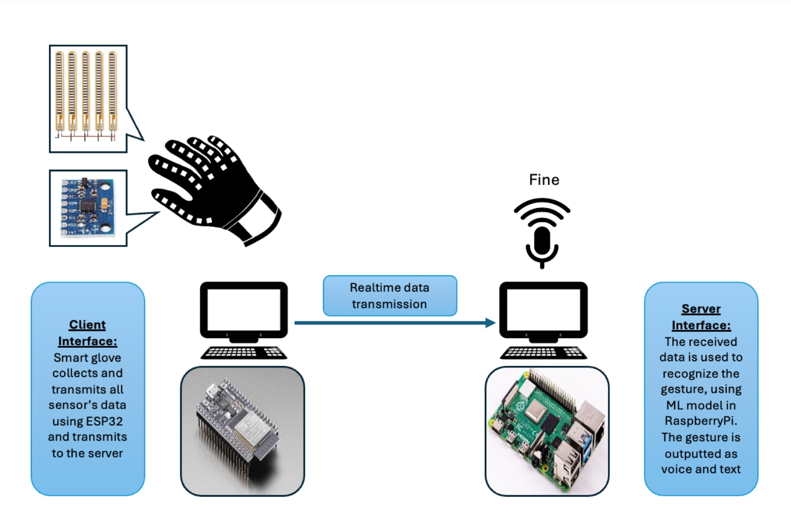

## Smart Glove

An innovative smart glove that interprets American Sign Language into real-time text and voice, enabling effortless and inclusive communication. The smart glove is an advanced wearable device designed to bridge communication barriers by translating American Sign Language (ASL) into real-time text and voice output. Equipped with flex sensors and accelerometers, the glove captures hand movements and gestures with precision, while machine learning algorithms process the data to ensure accurate interpretation. This project aims to foster seamless, inclusive communication for individuals with hearing or speech impairments, creating new opportunities for interaction in both personal and professional settings.

#### Block Diagram

The glove itself is equipped with an ESP32 microcontroller, an MPU6050 accelerometer and gyroscope, and flex sensors that measure finger movement in angle degrees. These sensors capture detailed hand and finger motions, which are transmitted to the Raspberry Pi over a socket connection via the internet. The sensor data collected by the glove is processed in real-time, enabling the system to accurately interpret ASL gestures. The ESP32 acts as the communication interface between the glove and the Raspberry Pi, ensuring that the data is reliably sent for processing, allowing the system to respond quickly and provide both visual and auditory feedback.

The system is built around a Raspberry Pi, which serves as the central hub for training and testing the machine learning model that recognizes American Sign Language (ASL) gestures. The Raspberry Pi is connected to a pair of headphones, providing real-time voice output to users when an ASL gesture is recognized. This allows for seamless communication, where the glove translates gestures into both text and voice. The Raspberry Pi processes data received from the glove, running the machine learning algorithms to predict the corresponding ASL letter or phrase based on the input from the sensors.